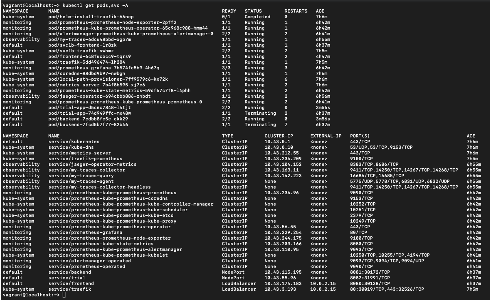
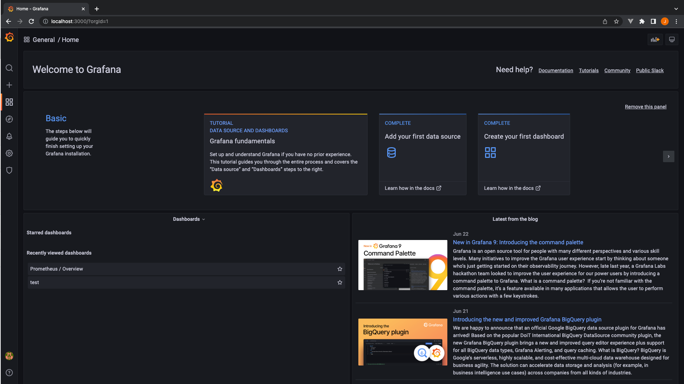
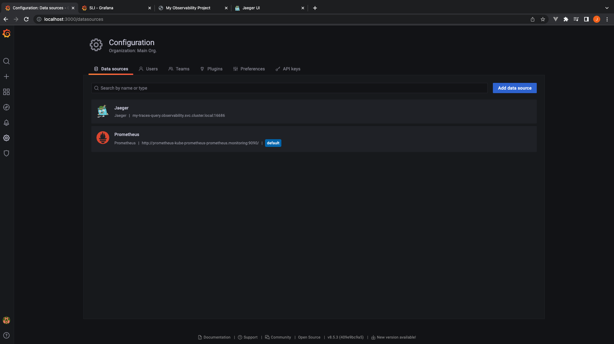
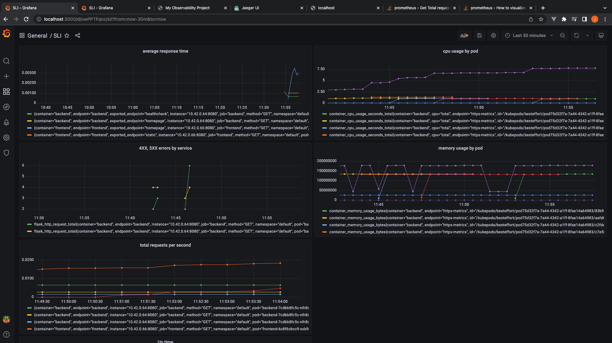
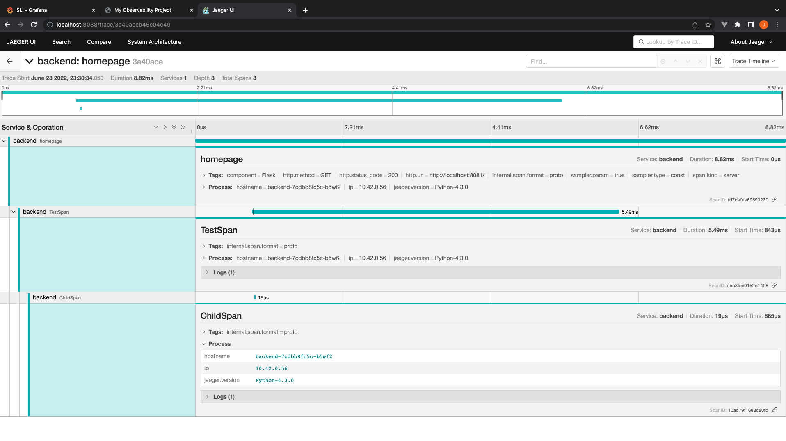
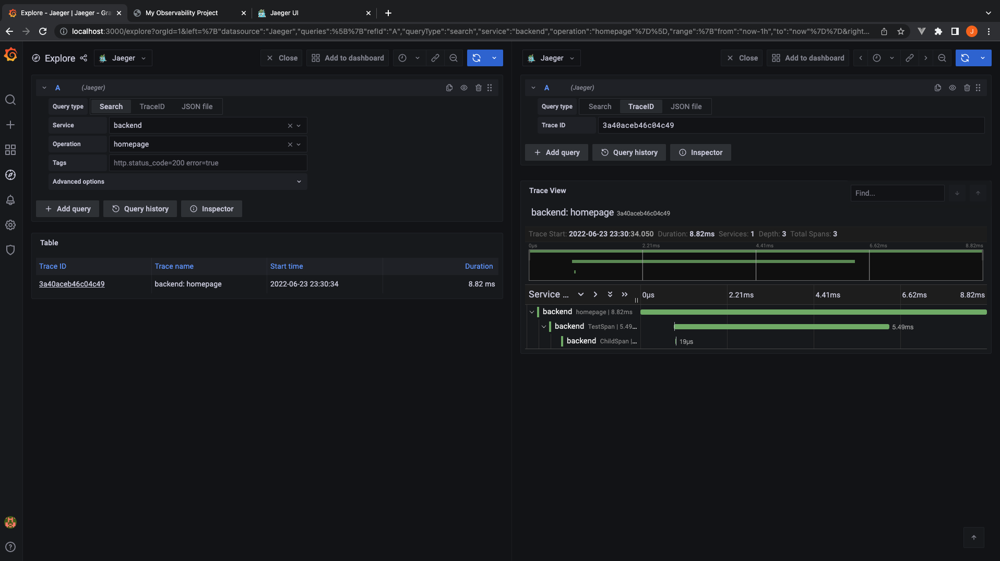
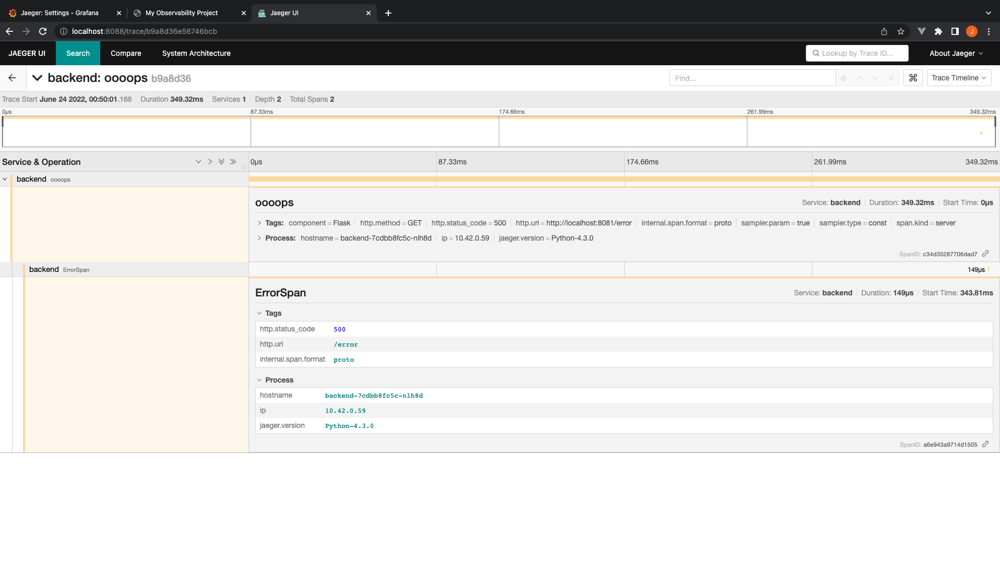
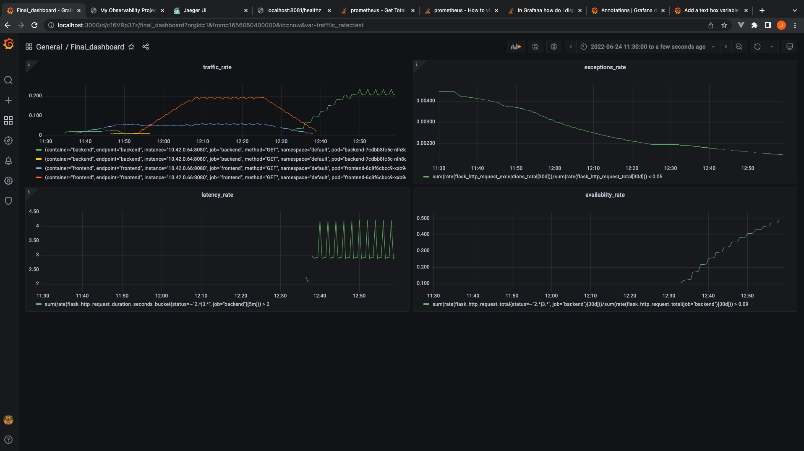

**Note:** For the screenshots, you can store all of your answer images in the `answer-img` directory.

## Verify the monitoring installation

*TODO:* run `kubectl` command to show the running pods and services for all components. Take a screenshot of the output and include it here to verify the installation

## Setup the Jaeger and Prometheus source
*TODO:* Expose Grafana to the internet and then setup Prometheus as a data source. Provide a screenshot of the home page after logging into Grafana.

## Create a Basic Dashboard
*TODO:* Create a dashboard in Grafana that shows Prometheus as a source. Take a screenshot and include it here.

## Describe SLO/SLI
*TODO:* Describe, in your own words, what the SLIs are, based on an SLO of *monthly uptime* and *request response time*.
1. 99% uptime in a month is a service level objective metric useful for site engineers to understand the system breakdowns(proportion of HTTP requests that returns 5XX status codes).
SLIs - percentage of HTTP requests returns status range of 2XX-3XX in a month
2. 95% of requests responds < 100 ms in a month is a service level objective metric(latency) 
SLIs - percentage of requests which responds in less than 100ms in a month

## Creating SLI metrics.
*TODO:* It is important to know why we want to measure certain metrics for our customer. Describe in detail 5 metrics to measure these SLIs.
1. Latency
    The time taken for a system/service to respond(both successfull(2XX) and failed(5XX)).
2. Availability
    Proportion of successful responses for all HTTP requests to the servers in a give time period.
3. Traffic
    Rate of requests handling by a server(requests/sec) in a given time period.
4. Error
    The number of requests the server responds/throws error in a given time period.
5. Saturation
    Amount of memory/CPU used by the system in a period of time. Helps to Automate scaling and manage costs.

## Create a Dashboard to measure our SLIs
*TODO:* Create a dashboard to measure the uptime of the frontend and backend services We will also want to measure to measure 40x and 50x errors. Create a dashboard that show these values over a 24 hour period and take a screenshot.

## Tracing our Flask App
*TODO:*  We will create a Jaeger span to measure the processes on the backend. Once you fill in the span, provide a screenshot of it here. Also provide a (screenshot) sample Python file containing a trace and span code used to perform Jaeger traces on the backend service.

## Jaeger in Dashboards
*TODO:* Now that the trace is running, let's add the metric to our current Grafana dashboard. Once this is completed, provide a screenshot of it here.

## Report Error
*TODO:* Using the template below, write a trouble ticket for the developers, to explain the errors that you are seeing (400, 500, latency) and to let them know the file that is causing the issue also include a screenshot of the tracer span to demonstrate how we can user a tracer to locate errors easily.

TROUBLE TICKET

Name: Jagadeesh K

Date: June24, 2021

Subject: Backend Internal Server Error

Affected Area: Testing backend service

Severity: Critical

Description: A testing 500 error to raise a ticket to developers and letting them know the trace.

## Creating SLIs and SLOs
*TODO:* We want to create an SLO guaranteeing that our application has a 99.95% uptime per month. Name four SLIs that you would use to measure the success of this SLO.
1. Traffic - rate at which HTTP requests measured over last hour.
2. Error - succes
3. Availability - Number of successful requests(both success and failed) requests in a day
4. Saturation - Each container CPU usage seconds

## Building KPIs for our plan
*TODO*: Now that we have our SLIs and SLOs, create a list of 2-3 KPIs to accurately measure these metrics as well as a description of why those KPIs were chosen. We will make a dashboard for this, but first write them down here.
1. Traffic rate should be > 5. This metric describes the customer traffic that following to our system. To start with initial traffic rate should be > 5. The reason to capture traffic rate metric is to understand the usability of the product. To understand the usability time or in demand services, also Low traffic rate might indicate the disliking of the product or may be the UI is not intuitive to use.
2. Successfull(2XX) requests Latency rate should be < 100ms. The reason to capture latency rate metric is to understand the customer waiting time for particular service request which helps to optimise the queries for successfull responses and examine the failed responses.
3. Error - rate of flask requests exceptions should be < 0.05%. The reason to capture error rate metric is to optimise the customer waiting time and also to reduce the customer frustration while using the product.
4. Availability - successful requests rate in a day should be > 99.5%. The reason to capture availabily of successful requests rate is to make sure our product services are available to customers with minimal downtime.

## Final Dashboard
*TODO*: Create a Dashboard containing graphs that capture all the metrics of your KPIs and adequately representing your SLIs and SLOs. Include a screenshot of the dashboard here, and write a text description of what graphs are represented in the dashboard.  
